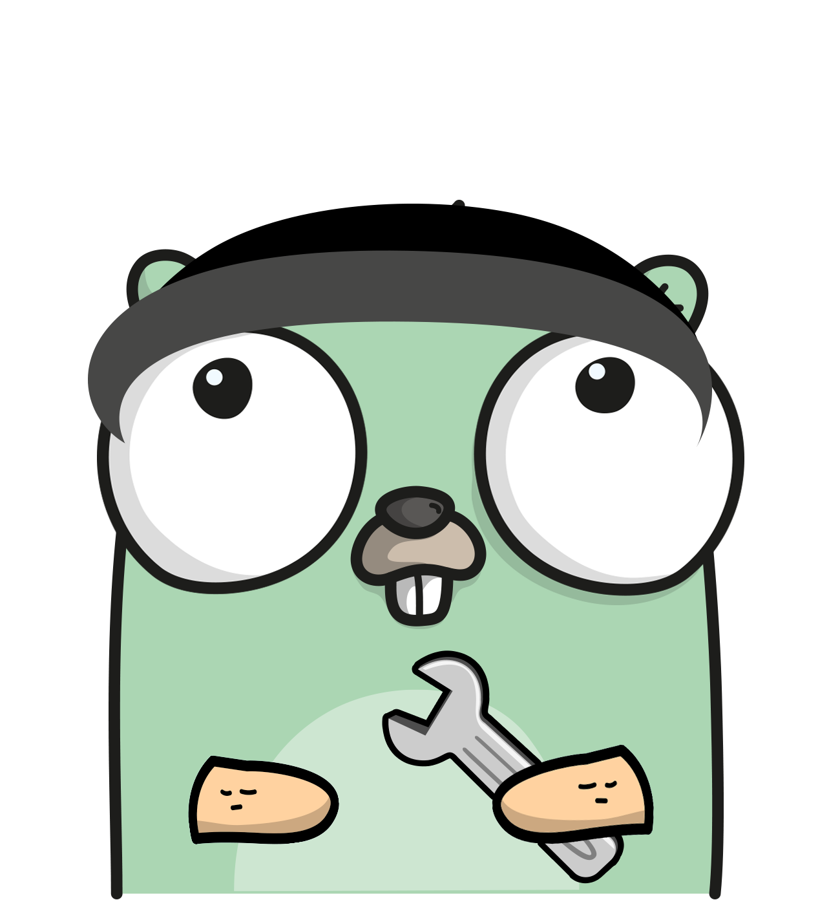

<div align="center">
	
</div>

# go-elements

[](https://travis-ci.com/vulpemventures/go-elements)
[](https://pkg.go.dev/github.com/vulpemventures/go-elements)
[](https://github.com/vulpemventures/go-elements/releases/latest)
[](https://goreportcard.com/report/github.com/vulpemventures/go-elements)
[](https://blockstream.info/address/3MdERN32qiMnQ68bSSee5CXQkrSGx1iStr)


Go support for confidential transactions on Elements-based blockchains

**The package is currently being developed.** For stable versions, you must refer to the [latest release](https://github.com/vulpemventures/go-elements/releases)

## Install

```sh
# Install latest tagged release
$ go get github.com/vulpemventures/go-elements@latest
```

## 👀 Examples

- [Broadcast unblinded transaction](pset/pset_test.go#L82)
- [Broadcast blinded transaction - with unblinded input](pset/pset_test.go#L335)
- [Broadcast blinded transaction - with blinded input](pset/pset_test.go#L490)
- [Broadcast issuance transaction - with unblinded inputs, unblinded issuance, blinded outputs](pset/pset_test.go#L689)
- [Broadcast issuance transaction - with unblinded inputs, blinded issuance, blinded outputs](pset/pset_test.go#L867)

## 🛣 Roadmap

- [x] Chain parameters (prefixes, magic numbers, …)
- [x] Pay to Public Key Hash
- [x] Pay to Script Hash
- [x] Pay to Witness Public Key Hash
- [x] Pay to Witness Script Hash
- [x] Tx serialization / deserialization
  - [x] Use of confidential values instead of pure numbers
  - [x] Fix order of witness in transaction serialization
  - [x] Add confidential fields
  - [x] Serialization for (witness) signature
- [x] [PSET / Bip174 for Elements](https://github.com/vulpemventures/go-elements/tree/master/pset)
- [x] [Blech32](https://github.com/vulpemventures/go-elements/tree/master/blech32)
- [x] [CGO bindings for secp256k1-zkp](https://github.com/vulpemventures/go-secp256k1-zkp)
- [x] Unblinding ins / Blinding outs / Blinding issuance ins
- [x] Signing a confidential input (use 0 value amounts to produce the hash for the signature)
- [x] Asset issuance
- [x] Asset re-issuance
- [x] Slip77
- [ ] Upcoming [PSET spec](https://github.com/ElementsProject/elements/pull/951) support

## 🖥 Development

* Clone repository:

```sh
$ git clone https://github.com/vulpemventures/go-elements.git
```

* Enter into the project folder and install dependencies:

```sh
$ cd go-elements
$ go get -t -v ./...
```

* Run tests

> For running tests it is required to have a running [Nigiri](https://github.com/vulpemventures/nigiri) locally, or at least a remote one reachable from the outside.  
 To run the tests it is mandatory to export an `API_URL` environment variable pointing to the URL of `nigiri-chopsticks`.

```
$ nigiri start --liquid
$ export API_URL=http://localhost:3001
$ go test ./... -v
```

* More detailed documentation

```
$ godoc -http ":8080"
```

> http://localhost:8080/pkg/github.com/vulpemventures/go-elements/

## 👷‍♂️ Contributors

- [@tiero](https://github.com/tiero)
- [@altafan](https://github.com/altafan)
- [@sekulicd](https://github.com/sekulicd)
- [@francismars](https://github.com/francismars)

## License [MIT](https://github.com/vulpemventures/go-elements/blob/master/LICENSE)
